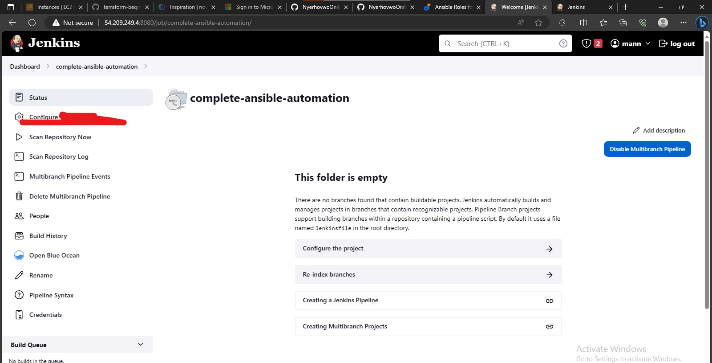
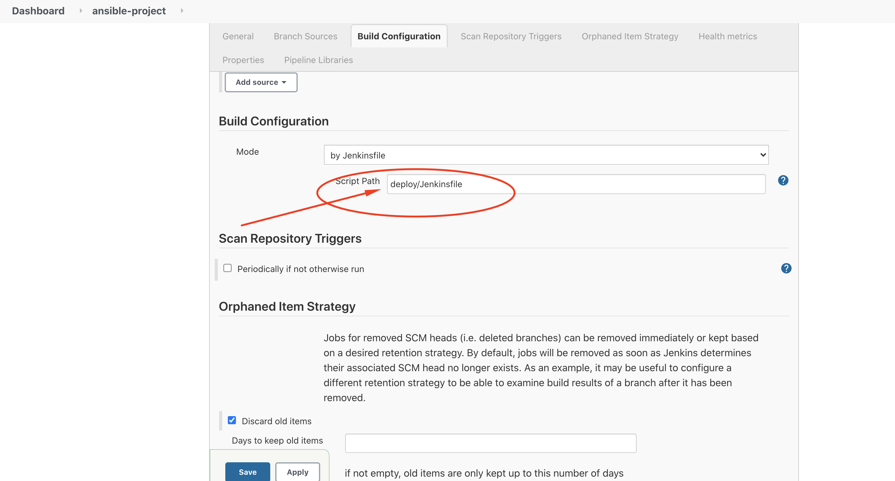
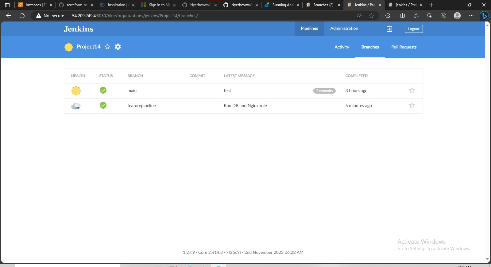
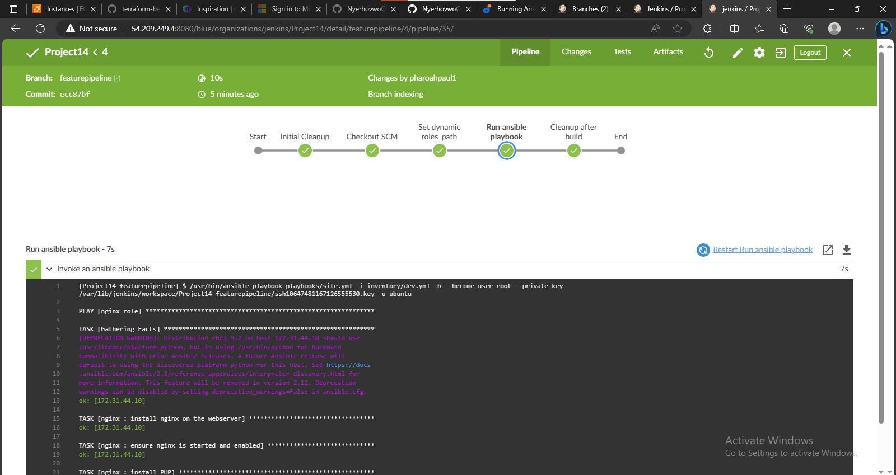
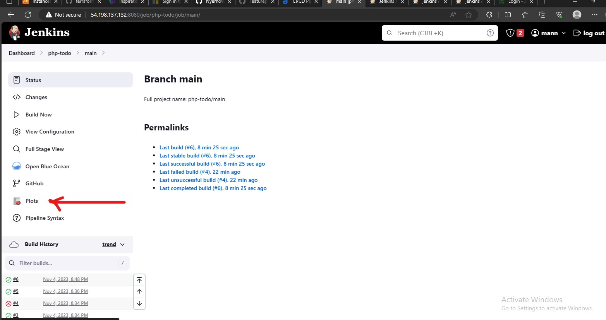
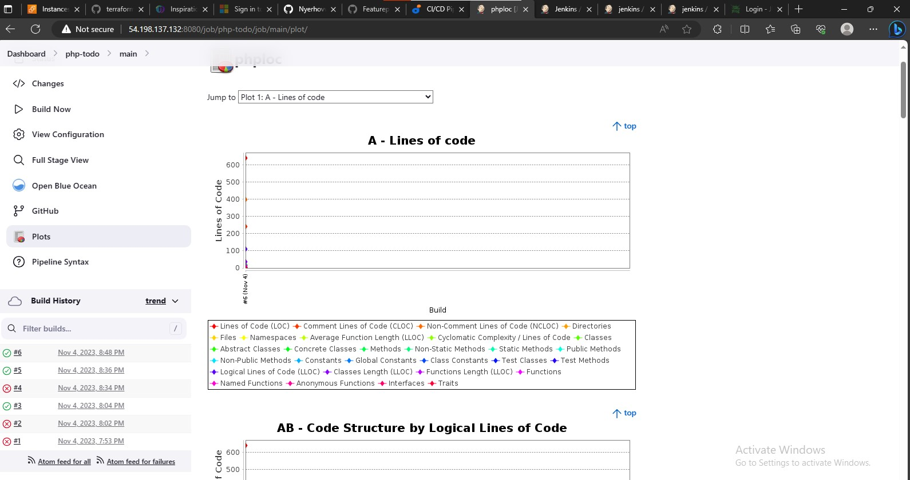
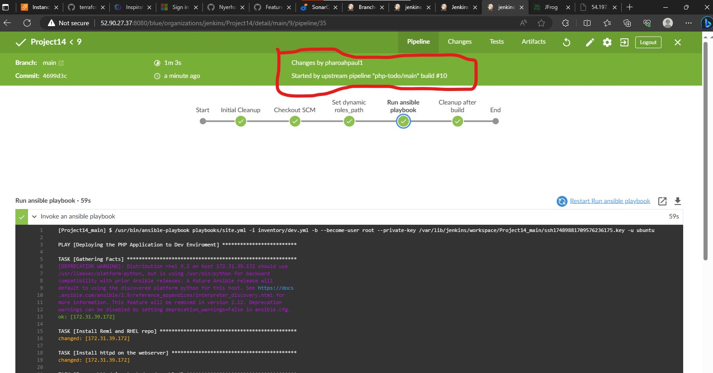
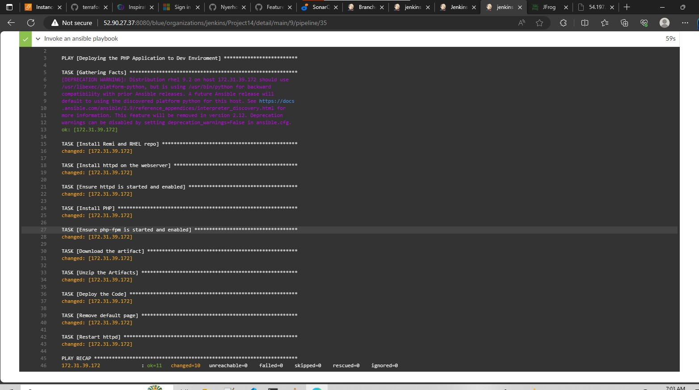

# Project 14: This is a continuation of [Project 13](https://github.com/NyerhovwoOnitcha/Ansible-Roles.git) where anisble roles were used to deploy a website, configure and deploy a database, deploy and configure a loadbalaancer. You will delve deeper into ansible roles to install sonarqube and artifactory

# Project 13 itself is an extension of [project 11](https://github.com/NyerhovwoOnitcha/complete-ansible-automation.git) so pull down the codes from the project 11 repo.

### You should have jenkins and ansible already installed on your jenkins server, change your jenkins instance type to t2.medium

# STEP 1: Install and configure jenkins

https://www.jenkins.io/doc/book/installing/linux/#red-hat-centos

## Configuring Jenkins for Ansible Deployment

From project 11-13 you have been launching Ansible commands manually from the CLI. Now, with Jenkins, we will start running Ansible from Jenkins UI.

### Install BlueOcean PLugin on your jenkins

- Navigate to Jenkins URL

- Install & Open Blue Ocean Jenkins Plugin

- Create a new pipeline


- Select Github


- Connect Jenkins to Github


- Login to github and Generate Access Token


- copy access token


- Paste the access token and connect


- Create a new pipeline

At this point you may not have a Jenkinsfile in the Ansible repository, so Blue Ocean will attempt to give you some guidance to create one. But we do not need that. We will rather create one ourselves. So, click on Administration to exit the Blue Ocean console.

Here is our newly created pipeline. It takes the name of your GitHub repository.


### Create a Jenkinsfile. 
The Jenkinsfile created is the jenkins config template that will call and run ansible i.e achieving automation

#### Inside the Ansible project, create a new directory deploy and start a new file Jenkinsfile inside the directory.

Add the code below start building the jenkinsfile

```
pipeline {
    agent any

  stages {
    stage('Build') {
      steps {
        script {
          sh 'echo "Building Stage"'
        }
      }
    }
    }
}
```

- GO configure your ansible pipeline in jenkins



- First go to **branch sources** and you will see **github credentials**, add new credentials. Choose the **username with password** where the username is your github username and your password is your github access token.

You do this because Jenkins/Blue Ocean needs to access your repo and pull the latest changes to your jenkinsfile and run the code, in this case an ansible playbook


- Scroll down to Build Configuration section and specify the location of the Jenkinsfile at deploy/Jenkinsfile



Push your code to your repo and on the ansible pipeline click **Build Now**

This will trigger a build and you will be able to see the effect of our basic Jenkinsfile configuration by going through the console output of the build.


 Add add more stages into the Jenkins file to simulate below phases. (Just add an echo command like we have in build and test stages)
   1. Package 
   2. Deploy 
   3. Clean up

```
pipeline {
    agent any

  stages {
	stage('Initial Cleanup') {
      steps {
        dir("${WORKSPACE}") {
          deleteDir()
        }
      }
    }
	
    stage('Build') {
      steps {
        script {
          sh 'echo "build stage"'
        }
      } 
    }

    stage('Test') {
      steps {
        script {
          sh 'echo "test stage"'
        }
      }
    }
	
	stage('Package') {
      steps {
        script {
          sh 'echo "Packaging stage"'
        }
      }
    }
	
	stage('Deploy') {
      steps {
        script {
          sh 'echo "Deploying stage"'
        }
      }
    }
	
	
	stage('Initial Workspace Cleanup') {
      steps {
        cleanWs()
      }
    }
	
  }  
}   

```


### Running Ansible from Jenkins

Now we have a good overview of jenkins pipeline and how it automates stuff i.e pulls code from SCM and run it, NOW we will achieve actual ansible deployment we will create a jenkinsfile from scratch that deploys ansible playbooks.

- Install ansible on the jenkins server
- Install ansible plugin in jenkins UI

#### Install the following dependencies
`sudo apt install python3 python3-pip wget unzip git -y`
`python3 -m pip install --upgrade setuptools`
`python3 -m pip install --upgrade pip`
`python3 -m pip install PyMySQL`
`python3 -m pip install mysql-connector-python`
`sudo apt-get install libpq-dev -y`
`python3 -m pip install psycopg2 --ignore-installed (needs libpq-dev to be installed first before it's installed)`
`ansible-galaxy collection install community.postgresql`

#### Writing the jenkinsfile for ansible deployment

Create a new branch and checkout to that branch

`git checkout -b featurepipeline`

Note that Jenkins needs to export the ANSIBLE_CONFIG environment variable. You can put the .ansible.cfg file alongside Jenkinsfile in the deploy directory.

Remember that **ansible.cfg** must be exported to environment variable so that Ansible knows where to find Roles. But because you will possibly run Jenkins from different git branches, the location of Ansible roles will change. Therefore, you must handle this dynamically. You can use Linux Stream Editor sed to update the section roles_path each time there is an execution. You may not have this issue if you run only from the main branch

Thus, create an `ansible.cfg` file in the deploy folder and paste the following code snippet into it

```
[defaults]
host_key_checking = False
```

- Observe that we are not defining the `roles_path` in the ansible.cfg file, we will allow our jenkinsfile define the roles path.

#### Exporting ansible.cfg file as environment variable
The environment variable is created exported like this

```
pipeline {
  agent any

  environment {
    ANSIBLE_CONFIG="${WORKSPACE}/deploy/ansible.cfg"
  }
}
```

The `${workspace}` is the `jenkins_home/workspace/branch` i.e `/var/lib/jenkins/workspace/featurepipeline`. The workspace changes depending on the branch we are working on, it could be main branch, a feature branch, etc. Thus exporting it like this makes sure jenkins exports the right `ansible config` file as jenkins uses only the files inside the workspace. 

#### Dynamically setting the `roles_path`

We use the sed command to insert the `roles_path` into the `ansible.cfg` file

```
pipeline {
    agent any

    environment {
        ANSIBLE_CONFIG="${WORKSPACE}/deploy/ansible.cfg"
    }


    stages {
        stage('Initial Cleanup') {
            steps {
                dir("${WORKSPACE}") {
                    deleteDir()
                }
            }
        }

        stage('Checkout SCM') {
            steps {
                git branch: 'featurepipeline', url: 'https://github.com/NyerhovwoOnitcha/Project14.git'
            }
        }

        stage('Set dynamic roles_path') {
            steps {
                sh 'echo ${WORKSPACE}'
                sh 'sed -i "3 a roles_path=${WORKSPACE}/roles" ${WORKSPACE}/deploy/ansible.cfg'
            }
        }

        stage('Run ansible playbook') {
            steps {
                ansiblePlaybook become: true, colorized: true, credentialsId: 'private-key', disableHostKeyChecking: true, installation: 'Ansible', inventory: 'inventory/dev.yml', playbook: 'playbooks/site.yml'
            }
        }

        stage('Cleanup after build') {
            steps {
                cleanWs(cleanWhenAborted: true, cleanWhenFailure: true, cleanWhenNotBuilt: true, cleanWhenUnstable: true, deleteDirs: true)
            }
        }
    }
}
```

### Configure Ansible on the Jenkins UI

Ansible will need to ssh to it's node when it is called upon by the jenkinsfile, we need to set up this connection.

Go to credentials, global credentials:

- kind: ssh username with key
- id: private-key
- username: ubuntu or ec2-user
- key: paste the private key to be used by ansible for ssh connections

SET UP the Ansible tool:

Manage jenkins -> tools -> ansible installations -> add ansible

- name: ansible
- Path to ansible executables directory: /usr/bin/

### Run the Playbook

Create 2 servers and add them to your dev env

- ubuntu server: DB
- Redhat server: Nginx

Edit the `site.yml` file to call reference the Mysql and Nginx role. 

Push your code and let the jenkinsfile trigger ansible





The Dev environment has an up to date configuration as it is but, what if we need to deploy to other environments?  
- Are we going to manually update the Jenkinsfile to point inventory to those environments? such as sit, uat, pentest, etc. ?
- Or do we need a dedicated git branch for each environment, and have the inventory part hard coded there ?

Since the goal is automation, manually updating the Jenkinsfile is definitely not an option, what we will be doing is to parameterise the deployment. So that at the point of execution, the appropriate values are applied.

### Parameterizing Jenkinsfile For Ansible Deployment

For values like the environment where there are multiple options, instead of hardcoding a value as we did with `dev environment` initially we can use parameters. This gives us flexibility and aids automation

```
pipeline {
    agent any

    parameters {
      string(name: 'inventory', defaultValue: 'dev.yml',  description: 'This is the inventory file for the environment to deploy configuration')
    }
```

After setting the inventory parameter globally above, we ensure it's no longer hard coded:

```
        stage('Run ansible playbook') {
            steps {
                ansiblePlaybook become: true, colorized: true, credentialsId: 'private-key', disableHostKeyChecking: true, installation: 'Ansible', inventory: 'inventory/${inventory}', playbook: 'playbooks/site.yml'
            }
```
**'inventory/${inventory}'** is used instead of just hardcoding `dev.yml` env as we did earlier. 

When you push your code to your SCM and jenkins pulls the jenkinsfile, you realize that it gives you an option to `build with parameters`, you can input the desired env there


## CI/CD PIPELINE FOR TODO APPLICATION

We will introduce a PHP application to add to the list of software products we are managing in our infrastructure. This application will have unit tests, it is an ideal application to show an end-to-end CI/CD pipeline for a particular application.

Unlike the tooling website, Our goal here is to deploy the application onto servers directly from Artifactory rather than from git.

### Step 1: Prepare Jenkins

- Fork the repository below into your GitHub account

```
https://github.com/darey-devops/php-todo.git
```

#### On you Jenkins server, install PHP, its dependencies and Composer tool ( Use a role for this). The dependencies to be installed

- `apt install php7.4-cli` This installs the following packages:
```
root@ip-172-31-42-33:/home/ubuntu# i
Reading package lists... Done
Building dependency tree       
Reading state information... Done
The following additional packages will be installed:
  php-common php7.4-common php7.4-json php7.4-opcache php7.4-readline
Suggested packages:
  php-pear
The following NEW packages will be installed:
  php-common php7.4-cli php7.4-common php7.4-json php7.4-opcache php7.4-readline
0 upgraded, 6 newly installed, 0 to remove and 0 not upgraded.
Need to get 2650 kB of archives.
After this operation, 13.2 MB of additional disk space will be used.
Do you want to continue? [Y/n] y
```

- install composer using the role or the command below
```
- curl -sS https://getcomposer.org/installer | php 
- sudo mv composer.phar /usr/bin/composer

```

- Install other dependencies

` sudo apt install -y zip libapache2-mod-php phploc php-{xml,bcmath,bz2,intl,gd,mbstring,mysql,zip}`
<!-- 
`systemctl start php-fpm $$ systemctl enable php-fpm` -->

- Install mysql client

`sudo apt-get install mysql-client`


- Create an artifactory server(redhat, t2-Medium) and deploy it in the `ci environment`


- Create a local repository on the artifactory GUI


- Install the following Jenkins plugins
  - Plot plugin
  - Artifactory plugin

We will use plot plugin to display tests reports, and code coverage information.
The Artifactory plugin will be used to easily upload code artifacts into an Artifactory server.

- In Jenkins UI configure Artifactory


Configure the server ID, URL and Credentials, and run Test Connection. 

Go to: Manage Jenkins -> System -> Jfrog -> Add JFrog Platform Instance

If successful you will see a messages like: `Found JFrog Artifactory 7.71.3 at http://107.23.106.53:8081/artifactory`


### Step 2: Integrate Artifactory repository with Jenkins

- On the database server create database and user. The PHP ToDo app needs to connect to a database hence this step.
**Use the role to achieve this.**

```
Create database homestead;
CREATE USER 'homestead'@'%' IDENTIFIED BY 'sePret^i';
GRANT ALL PRIVILEGES ON * . * TO 'homestead'@'%';
```


- Create a dummy Jenkinsfile in the PHP TODO repository

- Using Blue Ocean, create a multibranch Jenkins pipeline


- Update the database connectivity requirements in the file .env.sample

Add the following to the **DB connection block**
```
DB_CONNECTION=mysql
DB_PORT=3306
DB_HOST= <private ip of DB server>
```

- Update Jenkinsfile with proper pipeline configuration

```
pipeline {
    agent any

  stages {

     stage("Initial cleanup") {
          steps {
            dir("${WORKSPACE}") {
              deleteDir()
            }
          }
        }

    stage('Checkout SCM') {
      steps {
            git branch: 'main', url: 'https://github.com/NyerhovwoOnitcha/php-todo.git'
      }
    }

    stage('Prepare Dependencies') {
      steps {
             sh 'mv .env.sample .env'
             sh 'composer install'
             sh 'php artisan migrate'
             sh 'php artisan db:seed'
             sh 'php artisan key:generate'
      }
    }
    
  }
} 
```

**Note the Prepare Dependencies Section**
```
- The required file by PHP is .env so we are renaming .env.sample to .env

- Composer is used by PHP to install all the dependent libraries used by the application

- php artisan uses the .env file to setup the required database objects 
```

**After successful run of this step, login to the database, run show tables and you will see the tables being created for you unlike earlier when it was empty**


#### Unit tests

Update the Jenkinsfile to include Unit tests step
```
stage('Execute Unit Tests') {
      steps {
             sh './vendor/bin/phpunit'
      } 
```


### Step 3: Code Quality Analysis

For PHP the most commonly tool used for code quality analysis is phploc. Read more about [phploc](https://matthiasnoback.nl/2019/09/using-phploc-for-quick-code-quality-estimation-part-1/) here.

The data produced by phploc can be ploted onto graphs in Jenkins.

- Add the code analysis step in Jenkinsfile. The output of the data will be saved in build/logs/phploc.csv file.
```
stage('Code Analysis') {
  steps {
        sh 'phploc app/ --log-csv build/logs/phploc.csv'

  }
}
```

- Plot the data using plot Jenkins plugin.

```
 stage('Plot Code Coverage Report') {
      steps {

            plot csvFileName: 'plot-396c4a6b-b573-41e5-85d8-73613b2ffffb.csv', csvSeries: [[displayTableFlag: false, exclusionValues: 'Lines of Code (LOC),Comment Lines of Code (CLOC),Non-Comment Lines of Code (NCLOC),Logical Lines of Code (LLOC)                          ', file: 'build/logs/phploc.csv', inclusionFlag: 'INCLUDE_BY_STRING', url: '']], group: 'phploc', numBuilds: '100', style: 'line', title: 'A - Lines of code', yaxis: 'Lines of Code'
            plot csvFileName: 'plot-396c4a6b-b573-41e5-85d8-73613b2ffffb.csv', csvSeries: [[displayTableFlag: false, exclusionValues: 'Directories,Files,Namespaces', file: 'build/logs/phploc.csv', inclusionFlag: 'INCLUDE_BY_STRING', url: '']], group: 'phploc', numBuilds: '100', style: 'line', title: 'B - Structures Containers', yaxis: 'Count'
            plot csvFileName: 'plot-396c4a6b-b573-41e5-85d8-73613b2ffffb.csv', csvSeries: [[displayTableFlag: false, exclusionValues: 'Average Class Length (LLOC),Average Method Length (LLOC),Average Function Length (LLOC)', file: 'build/logs/phploc.csv', inclusionFlag: 'INCLUDE_BY_STRING', url: '']], group: 'phploc', numBuilds: '100', style: 'line', title: 'C - Average Length', yaxis: 'Average Lines of Code'
            plot csvFileName: 'plot-396c4a6b-b573-41e5-85d8-73613b2ffffb.csv', csvSeries: [[displayTableFlag: false, exclusionValues: 'Cyclomatic Complexity / Lines of Code,Cyclomatic Complexity / Number of Methods ', file: 'build/logs/phploc.csv', inclusionFlag: 'INCLUDE_BY_STRING', url: '']], group: 'phploc', numBuilds: '100', style: 'line', title: 'D - Relative Cyclomatic Complexity', yaxis: 'Cyclomatic Complexity by Structure'      
            plot csvFileName: 'plot-396c4a6b-b573-41e5-85d8-73613b2ffffb.csv', csvSeries: [[displayTableFlag: false, exclusionValues: 'Classes,Abstract Classes,Concrete Classes', file: 'build/logs/phploc.csv', inclusionFlag: 'INCLUDE_BY_STRING', url: '']], group: 'phploc', numBuilds: '100', style: 'line', title: 'E - Types of Classes', yaxis: 'Count'
            plot csvFileName: 'plot-396c4a6b-b573-41e5-85d8-73613b2ffffb.csv', csvSeries: [[displayTableFlag: false, exclusionValues: 'Methods,Non-Static Methods,Static Methods,Public Methods,Non-Public Methods', file: 'build/logs/phploc.csv', inclusionFlag: 'INCLUDE_BY_STRING', url: '']], group: 'phploc', numBuilds: '100', style: 'line', title: 'F - Types of Methods', yaxis: 'Count'
            plot csvFileName: 'plot-396c4a6b-b573-41e5-85d8-73613b2ffffb.csv', csvSeries: [[displayTableFlag: false, exclusionValues: 'Constants,Global Constants,Class Constants', file: 'build/logs/phploc.csv', inclusionFlag: 'INCLUDE_BY_STRING', url: '']], group: 'phploc', numBuilds: '100', style: 'line', title: 'G - Types of Constants', yaxis: 'Count'
            plot csvFileName: 'plot-396c4a6b-b573-41e5-85d8-73613b2ffffb.csv', csvSeries: [[displayTableFlag: false, exclusionValues: 'Test Classes,Test Methods', file: 'build/logs/phploc.csv', inclusionFlag: 'INCLUDE_BY_STRING', url: '']], group: 'phploc', numBuilds: '100', style: 'line', title: 'I - Testing', yaxis: 'Count'
            plot csvFileName: 'plot-396c4a6b-b573-41e5-85d8-73613b2ffffb.csv', csvSeries: [[displayTableFlag: false, exclusionValues: 'Logical Lines of Code (LLOC),Classes Length (LLOC),Functions Length (LLOC),LLOC outside functions or classes ', file: 'build/logs/phploc.csv', inclusionFlag: 'INCLUDE_BY_STRING', url: '']], group: 'phploc', numBuilds: '100', style: 'line', title: 'AB - Code Structure by Logical Lines of Code', yaxis: 'Logical Lines of Code'
            plot csvFileName: 'plot-396c4a6b-b573-41e5-85d8-73613b2ffffb.csv', csvSeries: [[displayTableFlag: false, exclusionValues: 'Functions,Named Functions,Anonymous Functions', file: 'build/logs/phploc.csv', inclusionFlag: 'INCLUDE_BY_STRING', url: '']], group: 'phploc', numBuilds: '100', style: 'line', title: 'H - Types of Functions', yaxis: 'Count'
            plot csvFileName: 'plot-396c4a6b-b573-41e5-85d8-73613b2ffffb.csv', csvSeries: [[displayTableFlag: false, exclusionValues: 'Interfaces,Traits,Classes,Methods,Functions,Constants', file: 'build/logs/phploc.csv', inclusionFlag: 'INCLUDE_BY_STRING', url: '']], group: 'phploc', numBuilds: '100', style: 'line', title: 'BB - Structure Objects', yaxis: 'Count'

      }
    }
```

You should now see a Plot menu item on the left menu. Click on it to see the charts


 



### Step 4: Bundle the application code for into an artifact (archived package) upload to Artifactory

```
stage ('Package Artifact') {
    steps {
            sh 'zip -qr php-todo.zip ${WORKSPACE}/*'
     }
    
```


###  Step 5: Publish the resulted artifact into Artifactory

```
stage ('Upload Artifact to Artifactory') {
          steps {
            script { 
                 def server = Artifactory.server 'artifactory-server'                 
                 def uploadSpec = """{
                    "files": [
                      {
                       "pattern": "php-todo.zip",
                       "target": "<name-of-artifact-repository>/php-todo",
                       "props": "type=zip;status=ready"

                       }
                    ]
                 }""" 

                 server.upload spec: uploadSpec
               }
            }

        }
```


###  Step 6: Deploy the application to the dev environment by launching Ansible pipeline

```
stage ('Deploy to Dev Environment') {
    steps {
    build job: 'Project14/main/main', parameters: [[$class: 'StringParameterValue', name: 'env', value: 'dev']], propagate: false, wait: true
    }
  }
```

This snippet of code triggers another job i.e `Project14/main`which is the pipeline that invokes an ansible playbook.

So create a playbook that deploys the TODO app from the artifactory to a server in the dev environment.

**Thus the TODO app pipeline packages and publishes the app to an artifactory repo and triggers a 2nd pipeline that invokes an ansible playbook that deploys the app from the artifactory repo to the dev environment**






- create a server (redhat or ubuntu), add it to the dev inventory file i.e the dev environment
**Note**- The Udeployment.yml file deploys to ubuntu
        - The deploy.yml deploys to redhat


**Note** Now we have set up Unit Tests and Code Coverage Analysis with phpunit and phploc but, how are we certain that the code being deployed has the quality that meets corporate and customer requirements? 

This is where Quality Gate comes in, we implement Quality Gate to ensure that ONLY code with the required code coverage, and other quality standards make it through to the environments.

To achieve this, we need to configure SonarQube – An open-source platform developed by SonarSource for continuous inspection of code quality to perform automatic reviews with static analysis of code to detect bugs, code smells, and security vulnerabilities.

## SonarQube Installation 

2 concepts we must understand about SonqarQube:

- Software Quality – The degree to which a software component, system or process meets specified requirements based on user needs and expectations

- Quality gates are basically acceptance criteria which are usually presented as a set of predefined quality criteria that a software development project must meet in order to proceed from one stage of its lifecycle to the next one.

### Installing SonaeQube

The sonarqube.md details the manual steps for installing and setting up sonarqube.**(CREATE and USE a ROLE)**

Create an ubuntu server (t2-medium) to act as the sonarqube server

**Note**:
  - To run the SonarQube role you must have the following ansible comunity installed:
    * For Mysql Database
      - ansible-galaxy collection install community.mysql

    * For Postgresql Database
      - ansible-galaxy collection install community.postgresql


  -  You might run into an `unprivileged user error` when creating the database and user. Navigate this by installing `acl` on your jenkins server

  * Install ACL
      ```
      sudo apt-get install acl
      ```

   
    
  * add to yout [defaults] in your ansible.cfg file   
 ```
allow_world_readable_tmpfiles = True
pipelining = True
 ```

### Access SonarQube
To access SonarQube using browser, type server’s IP address followed by port 9000

`http://server_IP:9000/sonar`

Login: username and password =`admin`


### CONFIGURE SONARQUBE AND JENKINS FOR QUALITY GATE
 
#### In Jenkins, install SonarScanner plugin

Navigate to -> system -> Add SonarQube server as shown below:


#### Generate authentication token in SonarQube

Navigate to User -> My Account -> Security -> Generate Tokens

c621a3652b1340556dd33ca6b61f491bcae54a45


#### Configure Quality Gate Jenkins Webhook in SonarQube – The URL should point to your Jenkins server- The URL should point to your Jenkins server `http://{JENKINS_HOST}/sonarqube-webhook/``

Administration -> Configuration -> Webhooks -> Create

#### Setup SonarQube scanner from Jenkins – Global Tool Configuration

Manage Jenkins -> Tools -> Add SonarQube Scanner


#### Update Jenkins Pipeline to include SonarQube scanning and Quality Gate

Below is the snippet for a Quality Gate stage in Jenkinsfile.

```
    stage('SonarQube Quality Gate') {
        environment {
            scannerHome = tool 'SonarQubeScanner'
        }
        steps {
            withSonarQubeEnv('sonarqube') {
                sh "${scannerHome}/bin/sonar-scanner"
            }

        }
    }
```
NOTE: when you run the above step it will fail because we have not updated `sonar-scanner.properties` but, Jenkins will install the scanner tool on the Linux server, we will then go go into the tools directory on the server to configure the properties file i.e `sonar-scanner.properties` in which SonarQube will require to function during pipeline execution.

`cd /var/lib/jenkins/tools/hudson.plugins.sonar.SonarRunnerInstallation/SonarQubeScanner/conf/`

- Open sonar-scanner.properties file

`sudo vi sonar-scanner.properties`

- Add configuration related to php-todo project

```
sonar.host.url=http://<SonarQube-Server-IP-address>:9000
sonar.projectKey=php-todo
#----- Default source code encoding
sonar.sourceEncoding=UTF-8
sonar.php.exclusions=**/vendor/**
sonar.php.coverage.reportPaths=build/logs/clover.xml
sonar.php.tests.reportPath=build/logs/junit.xml
```

Run your pipeline and go to the sonarqube UI to see if your code is of low quality

### Conditions to effect Gitflow

- First, we will include a When condition to run Quality Gate whenever the running branch is either develop, hotfix, release, main, or master
```
when { branch pattern: "^develop*|^hotfix*|^release*|^main*", comparator: "REGEXP"}
```

- Then we add a timeout step to wait for SonarQube to complete analysis and successfully finish the pipeline only when code quality is acceptable

```
    timeout(time: 1, unit: 'MINUTES') {
        waitForQualityGate abortPipeline: true
    }
```

The Jenkinsfile will be this:
```
stage('SonarQube Quality Gate') {
      when { branch pattern: "^develop*|^hotfix*|^release*|^main*", comparator: "REGEXP"}
        environment {
            scannerHome = tool 'SonarQubeScanner'
        }
        steps {
            withSonarQubeEnv('sonarqube') {
                sh "${scannerHome}/bin/sonar-scanner -Dproject.settings=sonar-project.properties"
            }
            timeout(time: 1, unit: 'MINUTES') {
                waitForQualityGate abortPipeline: true
            }
        }
    }
```

The code basically says that if the branch pattern matches any of the names specified: `"^develop*|^hotfix*|^release*|^main*"`, then run the SonarQubeScanner on the code
And to wait for QualityGate to finis it's analysis of our code and to abort the pipeline if there are bugs.